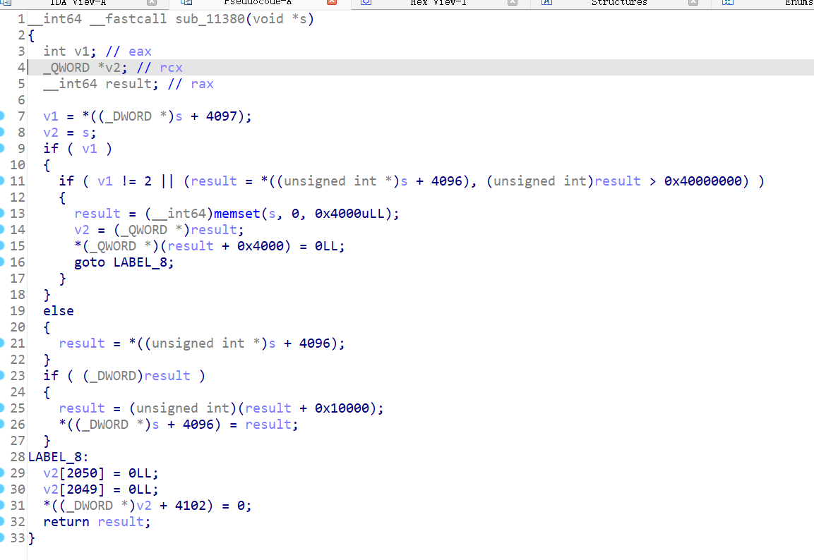

#  Control-flow Structing

## About  Control-flow Structing 

 根据IDA白皮书，可以得到大致的反编译器流程如下：


控制流结构化：指的是恢复高层伪代码的语法控制结构，例如：if-else，for，while结构等等。 控制流结构化是反编译中基础且关键的一环。

## Main

      1. src目录基于IDA microcode实现了一大半的 “no more goto” 的算法；
      1. 代码写的很烂，后续有时间继续优化；
      1. 非sese region的处理部分暂未处理；
      1. 对于条件变量的声明和处理部分我觉得还需思考（条件表达式的处理）

## Example

lz4-s IDA F5效果：




运行 .\src\run.bat 之后的效果（没有goto语句）: 

```c
void sub_11380() 
{
	block0
    if(!Block3 || !Block2)
    {
        block4
        block5
    }
    if(!Block1)
    {
        block6
    }
    if(!Block3 || !Block1)
    {
        if(block7)
        {
            block8
        }
        
    }
    block9
    block10
}
```

## Discussion

相比于Ghidra， IDA Control-flow Structing做的较差。 原因有以下2点：

1. IDA 对try-except 以及 C++的SEH 不做处理，代码经常缺一块；
2. IDA的noreturn函数识别效果极差

noreturn函数识别存在以下2中错误 ：

1. 本来是noreturn函数但是未识别出来
2. 将不是noreturn的函数识别出了noreturn函数

上述的2中出现的一种情况是：

                1. 一个函数指针 fptr 被赋予了一个noreturn函数的地址 , 即 `fptr= (__noreturn) func_addr; `
                2. 接下来所有的call fptr指令，IDA都会认为fptr指向的是 noreturn函数，即认为 `（__noreturn）fptr();`
                3. 然而函数指针即使存在默认值，也可能在运行时被动态修改，因此这样的分析是错误的。

Ghidra不存在以上的所有问题。

而IDA相比于Ghidra相对强大的地方：

1. 优秀的人机交互，尤其是xref
2. 强大的idapython，尤其是18年开放了更为优秀的IR -- microcode

## Reference

1. No More Gotos: Decompilation Using Pattern-Independent Control-Flow Structuring and Semantics-Preserving Transformations -- (ndss 2015)
2.  A Comb for Decompiled C Code --(AsiaCCS 2020  另一种实现思路，我觉得存在一定弊端)
3. https://github.com/zeroKilo/DirectedGraphsWV/blob/master/How%20to%20write%20a%20basic%20control%20flow%20decompiler.pdf
4. https://medium.com/leaningtech/solving-the-structured-control-flow-problem-once-and-for-all-5123117b1ee2